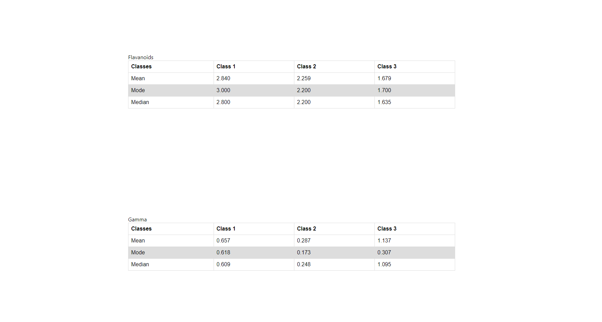

## RUN the Project

### `yarn install`
It's to install all the dependencies

### `yarn start`

Runs the app in the development mode.\
Open [http://localhost:3000](http://localhost:3000) to view it in your browser.

## Following are the output of the questions.

